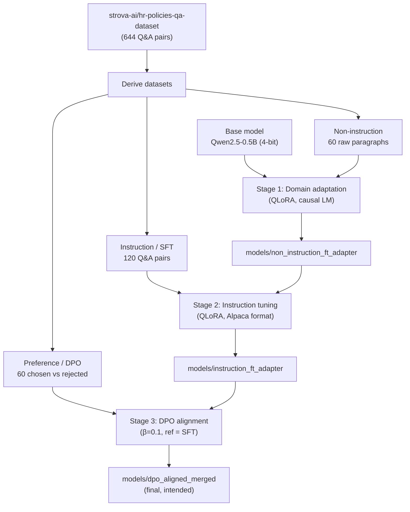
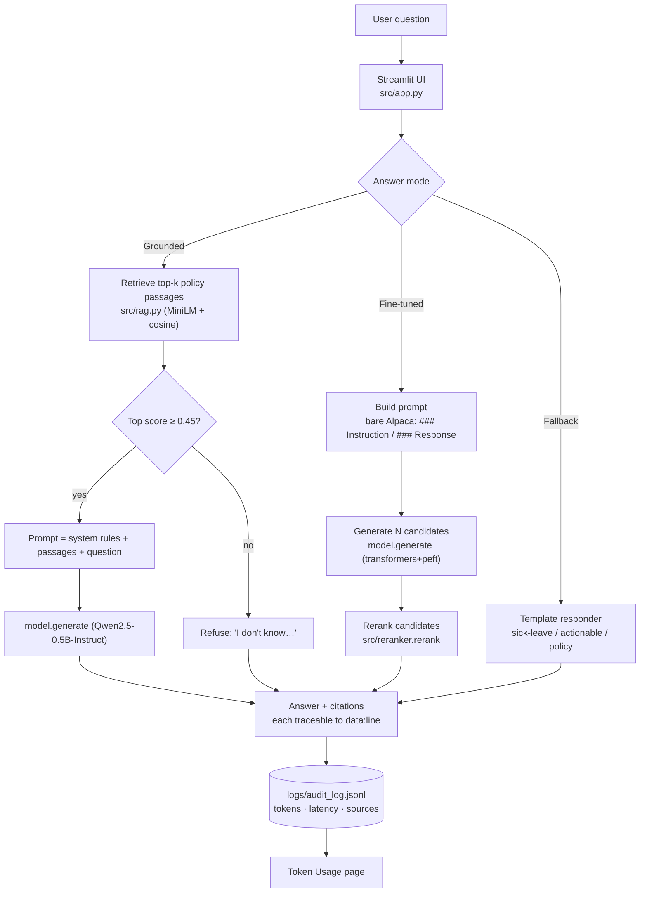

# HR Assistant — Architecture & Data Flow

This document explains how the HR Assistant is built, how data flows through it
at **training time** and at **inference time**, and what each component does. It
is the companion to [AZURE_DEPLOYMENT.md](AZURE_DEPLOYMENT.md).

---

## 1. What the system is

A domain-specific HR question-answering assistant. A small base model
(**Qwen2.5-0.5B**) is adapted to HR policy language through a **three-stage
fine-tuning pipeline**, then served behind a **Streamlit** chat UI. At inference
time the app generates several candidate answers per question and uses a
lightweight **reranker** to pick the best one.

> ⚠️ **Important:** This is a *fine-tuned parametric* model, **not** a Retrieval-
> Augmented Generation (RAG) system. There is no document retrieval step, so
> answers come purely from the model's weights. This is the main reason answers
> can be inaccurate. See §6.

---

## 2. Components

| Component | File | Role |
|---|---|---|
| Raw data | `data/*.jsonl`, `data/*.txt` | HR policy Q&A + paragraphs used to derive training sets |
| Stage 1 – domain adaptation | `notebooks/non_instruction_finetuning.ipynb` | Teach HR vocabulary via raw-text (causal LM) QLoRA |
| Stage 2 – instruction tuning (SFT) | `notebooks/instruction_finetuning.ipynb` | Teach the model to *answer questions* |
| Stage 3 – preference alignment (DPO) | `notebooks/dpo_alignment.ipynb` | Align tone/quality using chosen/rejected pairs |
| Model artifacts | `models/*` | LoRA adapters / merged weights per stage |
| Generation backend | `src/generation.py` | Portable `transformers`+`peft` loading, prompt, `model.generate`, rerank |
| Inference engine | `src/inference.py` | `HRAssistant` wrapper + CLI (delegates to the generation backend) |
| Web UI | `src/app.py` | Streamlit chat front-end (delegates to the generation backend) |
| Reranker | `src/reranker.py` | Scores candidate answers, returns the best |
| Fallback responder | `src/app.py`, `src/inference.py` | Deterministic canned answers when no model is loaded |

---

## 3. Training-time data flow

Each stage consumes the previous stage's weights, so the pipeline is sequential:
**domain vocabulary → follow instructions → preferred style**.

---

## 4. Inference-time data flow

This is what happens on every question in the running app. The sidebar
**Answer mode** picks one of three paths; **Grounded (RAG)** is the default.

### Step-by-step — Grounded mode (default)
1. **Retrieve** — embed the question (MiniLM) and take the top-k policy passages
   by cosine similarity from the `hr_index/` vector store.
2. **Refuse-early gate** — if the best passage scores below `HR_RAG_MIN_SCORE`
   (0.45), return *"I don't know based on the company's policy documents."*
   without generating. This is the anti-fabrication guard.
3. **Grounded prompt** — a system prompt ("answer ONLY from these passages, cite
   by number, refuse otherwise") + the numbered passages + the question.
4. **Generate** — `model.generate()` (deterministic, `temperature=0`); the answer
   carries citations that trace to each passage's `data/<file>:<line>`.

### Step-by-step — Fine-tuned mode (ungrounded)
1. **Prompt construction** — `generation.build_prompt()` wraps the question in the
   **exact** format the model was fine-tuned on and nothing more:
   `### Instruction:\n{question}\n\n### Response:\n`. (An earlier version added a
   system prompt + extra instruction template; that was out-of-distribution and
   hurt quality, so it was removed.)
2. **Candidate generation** — `generation.generate_candidates()` calls
   `model.generate()` once with `num_return_sequences=N` (default 3), sampling with
   temperature/top-p and stopping on EOS. The prompt prefix is then stripped from
   each output.
3. **Reranking** — `reranker.rerank()` scores each candidate:
   - heavy penalty for code-like output (`#include`, `std::`, …),
   - bonus for numbered steps / the word "step" on actionable questions,
   - small penalties for too-short / too-long answers.
   The highest scorer wins (ties → first candidate).
4. **Code guard / retry** — if the winner still looks like code, regenerate once
   deterministically (`temperature=0`).

### Fallback mode
When `HR_FALLBACK` is set (or the sidebar box is ticked), the app skips the model
entirely and returns deterministic templated answers routed by keywords
(sick-leave → generic-actionable → policy). This path has **no** ML dependency at
all and is what the slim container image runs by default.

---

## 5. Runtime & platform notes

| Concern | Detail |
|---|---|
| Base model | Qwen2.5-0.5B (~500M params) |
| Fine-tuning | LoRA adapter (`peft`), loaded on top of the base model |
| Generation backend | `transformers` + `peft` via `model.generate()` — runs on **CPU, CUDA, or MPS** |
| Device selection | auto: CUDA → MPS → CPU, override with `HR_DEVICE` |
| UI | Streamlit, port **8501**, health endpoint `/_stcore/health` |
| Retrieval (grounded mode) | MiniLM embeddings + exact numpy cosine over `hr_index/`; generator `Qwen2.5-0.5B-Instruct` |
| Config | `HR_FALLBACK`, `HR_MODEL_PATH`, `HR_DEVICE`, `HR_RAG_MODEL`, `HR_RAG_MIN_SCORE`, `HR_AUDIT_LOG` |

The generation backend is now **portable**: because it uses standard
`transformers`/`peft` (no `mlx`, no Unsloth 4-bit), the fine-tuned 0.5B model can
run on a plain CPU container — no GPU required (GPU only speeds it up). The slim
image still defaults to fallback mode; see
[AZURE_DEPLOYMENT.md](AZURE_DEPLOYMENT.md) §"Deployment modes" for the model-serving
image.

---

## 6. Known limitations (why answers can still be imperfect)

**Fixed** (generation path now works):
- ✅ Default model is the **SFT adapter** (`instruction_ft_adapter`) — one that was
  actually trained to answer questions.
- ✅ Prompt format now matches training exactly (bare Alpaca).
- ✅ Generation uses `model.generate()` via `transformers`/`peft` — no more mlx loop
  or silent `strict=False` weight loading.

**Fixed** (grounding shipped):
- ✅ **Retrieval/grounding (RAG)** — the default mode retrieves policy passages and
  answers only from them, with citations and an out-of-corpus refusal. This is the
  fix for the "it hallucinates" problem: the fine-tuned model alone answered from
  weights and could confabulate.

**Remaining** (model/data limits, not code bugs):
1. **Small corpus** — grounded mode can only answer what's in `data/` (~180
   passages); outside that it correctly refuses. Growing the corpus is the
   highest-impact next step.
2. **Small model** — Qwen2.5-0.5B is tiny; answers are fluent but can be shallow.
   In grounded mode it mostly rephrases retrieved text, which mitigates this.
3. **No DPO/merged model on disk** — Stage 3 artifacts were never produced, so the
   assistant serves the SFT adapter rather than a preference-aligned model.
4. **Fine-tuned mode can still fabricate** — it answers from weights with no
   grounding; kept only for comparison. Prefer grounded mode.
