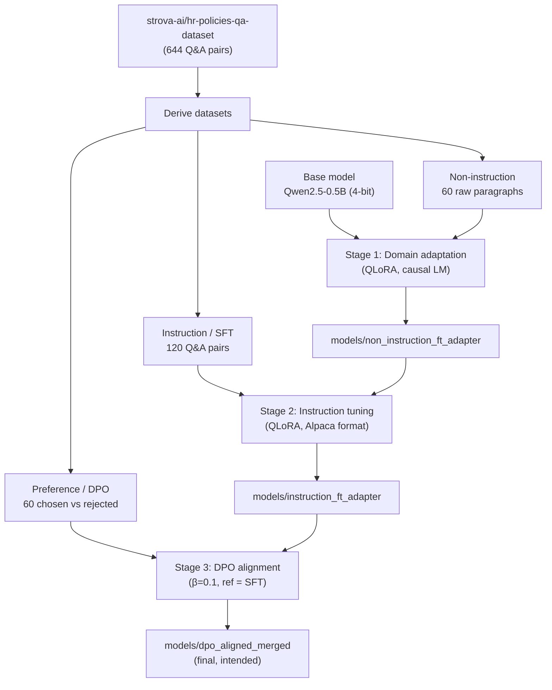
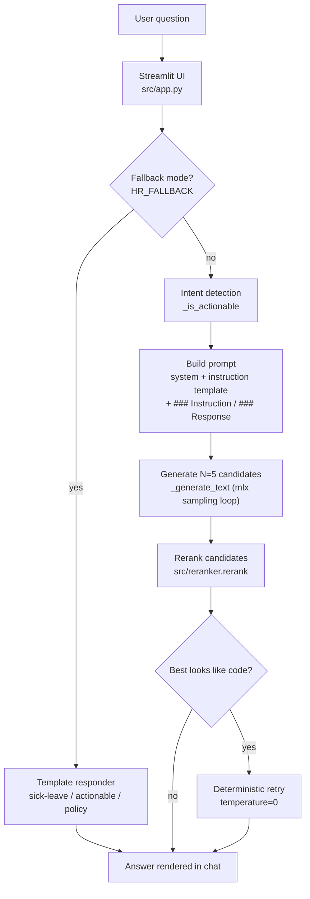

# HR Assistant — Architecture & Data Flow

This document explains how the HR Assistant is built, how data flows through it
at **training time** and at **inference time**, and what each component does. It
is the companion to [AZURE_DEPLOYMENT.md](AZURE_DEPLOYMENT.md).

---

## 1. What the system is

A domain-specific HR question-answering assistant. A small base model
(**Qwen2.5-0.5B**) is adapted to HR policy language through a **three-stage
fine-tuning pipeline**, then served behind a **Streamlit** chat UI. At inference
time the app generates several candidate answers per question and uses a
lightweight **reranker** to pick the best one.

> ⚠️ **Important:** This is a *fine-tuned parametric* model, **not** a Retrieval-
> Augmented Generation (RAG) system. There is no document retrieval step, so
> answers come purely from the model's weights. This is the main reason answers
> can be inaccurate. See §6.

---

## 2. Components

| Component | File | Role |
|---|---|---|
| Raw data | `data/*.jsonl`, `data/*.txt` | HR policy Q&A + paragraphs used to derive training sets |
| Stage 1 – domain adaptation | `notebooks/non_instruction_finetuning.ipynb` | Teach HR vocabulary via raw-text (causal LM) QLoRA |
| Stage 2 – instruction tuning (SFT) | `notebooks/instruction_finetuning.ipynb` | Teach the model to *answer questions* |
| Stage 3 – preference alignment (DPO) | `notebooks/dpo_alignment.ipynb` | Align tone/quality using chosen/rejected pairs |
| Model artifacts | `models/*` | LoRA adapters / merged weights per stage |
| Inference engine | `src/inference.py` | Loads model, builds prompt, samples, reranks (CLI) |
| Web UI | `src/app.py` | Streamlit chat front-end (same logic as inference) |
| Reranker | `src/reranker.py` | Scores candidate answers, returns the best |
| Fallback responder | `src/app.py`, `src/inference.py` | Deterministic canned answers when no model is loaded |

---

## 3. Training-time data flow

Each stage consumes the previous stage's weights, so the pipeline is sequential:
**domain vocabulary → follow instructions → preferred style**.

---

## 4. Inference-time data flow

This is what happens on every question in the running app.

### Step-by-step (model mode)
1. **Intent detection** — `_is_actionable()` checks for words like *how, apply,
   procedure, steps, submit*. Actionable questions get a "numbered procedure"
   instruction template; others get a "policy summary" template.
2. **Prompt construction** — a system prompt + the chosen instruction template +
   the question, wrapped in `### Instruction: / ### Response:` markers.
3. **Candidate generation** — `_generate_text()` runs a hand-rolled token loop
   (tokenize → forward pass → `_sample_next_token` with temperature/top-p → append
   → stop on EOS). It produces **5 candidates**.
4. **Reranking** — `reranker.rerank()` scores each candidate:
   - heavy penalty for code-like output (`#include`, `std::`, …),
   - bonus for numbered steps / the word "step" on actionable questions,
   - small penalties for too-short / too-long answers.
   The highest scorer wins (ties → first candidate).
5. **Code guard / retry** — if the winner still looks like code, regenerate once
   deterministically (`temperature=0`).

### Fallback mode
When `HR_FALLBACK` is set (or the sidebar box is ticked), the app skips the model
entirely and returns deterministic templated answers routed by keywords
(sick-leave → generic-actionable → policy). This path has **no** mlx/unsloth/torch
dependency and is what the container image runs by default.

---

## 5. Runtime & platform notes

| Concern | Detail |
|---|---|
| Base model | Qwen2.5-0.5B (~500M params) |
| Quantization | 4-bit (QLoRA) via Unsloth — **requires CUDA GPU** |
| Generation backend | `mlx.core` — **Apple Silicon only** (does not run on Azure Linux) |
| UI | Streamlit, port **8501**, health endpoint `/_stcore/health` |
| Config | `HR_FALLBACK`, `HR_MODEL_PATH` environment variables |

Because generation uses `mlx` (Apple Silicon) and 4-bit uses Unsloth (CUDA),
**the model-serving path is not portable to a generic Azure Linux container.**
The deployable image therefore defaults to fallback mode. Serving the real model
on Azure requires porting `_generate_text` to `torch`/`transformers` and running
on GPU compute — see [AZURE_DEPLOYMENT.md](AZURE_DEPLOYMENT.md) §"Deployment modes".

---

## 6. Known limitations (why answers can be wrong)

1. **No retrieval/grounding** — it is not RAG, so the model has nothing to ground
   answers in and will confabulate.
2. **Default model path** — the app defaults to `non_instruction_ft_adapter`, the
   domain-adaptation model that was never taught to answer questions.
3. **Missing final model** — `inference.py` defaults to `models/dpo_aligned_merged`,
   which does not exist on disk.
4. **Fragile generation** — the custom `mlx` loop, `strict=False` weight loading,
   and a training/inference prompt-format mismatch degrade output quality.

These are documented here so a deployer understands that fallback mode is the
reliable path today, and serving the fine-tuned model is a follow-up effort.
