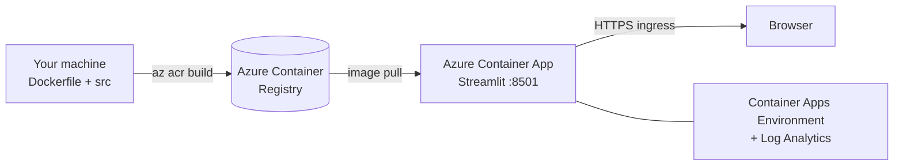

# Deploying the HR Assistant to Azure — Step by Step

This guide deploys the Streamlit UI (see [ARCHITECTURE.md](ARCHITECTURE.md)) to
**Azure Container Apps (ACA)** using **Azure Container Registry (ACR)**. ACA is a
serverless container platform — you pay only while the app runs, it scales to
zero, and it gives you HTTPS out of the box.

By default this deploys the app in **fallback mode** (deterministic HR responses,
no GPU). Serving the fine-tuned model is covered in [§9](#9-deployment-modes).

---

## 0. Architecture on Azure



---

## 1. Prerequisites

| Requirement | Check | Install |
|---|---|---|
| Azure subscription | `az account show` | https://azure.microsoft.com/free |
| Azure CLI ≥ 2.53 | `az version` | https://learn.microsoft.com/cli/azure/install-azure-cli |
| containerapp extension | `az extension show -n containerapp` | `az extension add -n containerapp` |
| The repo checked out | — | `git clone https://github.com/raosinga6/HR-assistant` |

> You do **not** need Docker installed locally — `az acr build` builds the image
> in the cloud from the `Dockerfile` in this repo.

---

## 2. Set variables

Pick a globally-unique ACR name (lowercase letters/numbers only). Run these in
your shell; later steps reuse them.

```bash
# --- edit these ---
export RG=hr-assistant-rg
export LOCATION=eastus
export ACR_NAME=hrassistantacr$RANDOM   # must be globally unique, 5-50 alnum
export APP_ENV=hr-assistant-env
export APP_NAME=hr-assistant
export IMAGE_TAG=v1
# ------------------

export IMAGE="$ACR_NAME.azurecr.io/hr-assistant:$IMAGE_TAG"
echo "Image will be: $IMAGE"
```

---

## 3. Log in and register providers

```bash
az login                                   # opens browser; use device code on headless: az login --use-device-code
az account set --subscription "<YOUR-SUBSCRIPTION-ID-OR-NAME>"

# One-time provider registration (safe to re-run)
az provider register -n Microsoft.App --wait
az provider register -n Microsoft.OperationalInsights --wait
az provider register -n Microsoft.ContainerRegistry --wait
```

---

## 4. Create the resource group

```bash
az group create --name "$RG" --location "$LOCATION"
```

---

## 5. Create the container registry and build the image

```bash
# Create the registry
az acr create --resource-group "$RG" --name "$ACR_NAME" --sku Basic --admin-enabled true

# Build the image IN the cloud from the repo root (where the Dockerfile is).
# Run this from the root of the HR assistant repo:
az acr build --registry "$ACR_NAME" --image "hr-assistant:$IMAGE_TAG" .
```

`az acr build` uploads the build context (kept small by `.dockerignore`), builds
using the `Dockerfile`, and stores the image in ACR. Confirm it landed:

```bash
az acr repository show-tags --name "$ACR_NAME" --repository hr-assistant --output table
```

---

## 6. Create the Container Apps environment

```bash
az containerapp env create \
  --name "$APP_ENV" \
  --resource-group "$RG" \
  --location "$LOCATION"
```

This provisions the ACA environment (and an associated Log Analytics workspace)
that the app runs in.

---

## 7. Create the container app

```bash
az containerapp create \
  --name "$APP_NAME" \
  --resource-group "$RG" \
  --environment "$APP_ENV" \
  --image "$IMAGE" \
  --registry-server "$ACR_NAME.azurecr.io" \
  --target-port 8501 \
  --ingress external \
  --cpu 0.5 --memory 1.0Gi \
  --min-replicas 0 \
  --max-replicas 2 \
  --env-vars HR_FALLBACK=1 \
  --query properties.configuration.ingress.fqdn -o tsv
```

Key flags:
- `--target-port 8501` — the port Streamlit listens on (matches the Dockerfile).
- `--ingress external` — exposes a public HTTPS URL.
- `--min-replicas 0` — scale to zero when idle (cheapest). Set to `1` to avoid
  cold-start delay.
- `--env-vars HR_FALLBACK=1` — run in fallback mode.

The command prints the app's FQDN. Open **`https://<fqdn>`** in a browser.

Fetch it again anytime:

```bash
az containerapp show -n "$APP_NAME" -g "$RG" \
  --query properties.configuration.ingress.fqdn -o tsv
```

---

## 8. Verify

```bash
FQDN=$(az containerapp show -n "$APP_NAME" -g "$RG" --query properties.configuration.ingress.fqdn -o tsv)
curl -sSf "https://$FQDN/_stcore/health" && echo "  <- healthy"
```

Then open `https://$FQDN`, ask an example question (e.g. *"How can I apply for
sick leave?"*), and confirm you get a numbered response.

---

## 9. Deployment modes

### Fallback mode (this guide, default)
- No GPU, no model download, tiny image, instant answers.
- Set `HR_FALLBACK=1` (already the Dockerfile default).
- **Limitation:** answers are deterministic templates, not model-generated.

### Serving the fine-tuned model (CPU-capable)
The generation backend (`src/generation.py`) uses standard `transformers` + `peft`
and `model.generate()`, so the fine-tuned 0.5B model **runs on a plain CPU
container — no GPU required** (a GPU only makes it faster). To build and deploy a
model-serving image:

1. **Build a model image.** Use `Dockerfile.model` (installs `torch`,
   `transformers`, `peft` from `requirements-model.txt`) instead of the slim
   Dockerfile:
   ```bash
   az acr build --registry "$ACR_NAME" --image "hr-assistant:model-$IMAGE_TAG" \
     --file Dockerfile.model .
   ```
2. **Make the weights available.** The base model downloads from the Hugging Face
   Hub on first run; the LoRA adapter under `models/` is copied into the image.
   (For air-gapped setups, pre-bake the HF cache or mount an Azure Files share.)
3. **Give the container enough resources** — the 0.5B model needs roughly:
   ```bash
   az containerapp update -n "$APP_NAME" -g "$RG" \
     --image "$ACR_NAME.azurecr.io/hr-assistant:model-$IMAGE_TAG" \
     --cpu 2.0 --memory 4.0Gi \
     --min-replicas 1 \
     --set-env-vars HR_FALLBACK=0 HR_MODEL_PATH=models/instruction_ft_adapter HR_DEVICE=cpu
   ```
4. (Optional) For lower latency at higher cost, run on **GPU compute** — Azure ML
   Managed Online Endpoints, AKS with a GPU node pool, or a GPU VM — and set
   `HR_DEVICE=cuda`.

> Note: CPU generation for a 0.5B model is a few seconds per answer, which is fine
> for a low-traffic assistant. Keep `--min-replicas 1` to avoid cold-start model
> loads on every request.

---

## 10. Updating the app (new revision)

After code changes, rebuild and roll a new revision:

```bash
export IMAGE_TAG=v2
az acr build --registry "$ACR_NAME" --image "hr-assistant:$IMAGE_TAG" .
az containerapp update \
  --name "$APP_NAME" --resource-group "$RG" \
  --image "$ACR_NAME.azurecr.io/hr-assistant:$IMAGE_TAG"
```

ACA creates a new revision and shifts traffic to it automatically (single-revision
mode). Roll back by activating a previous revision:

```bash
az containerapp revision list -n "$APP_NAME" -g "$RG" -o table
az containerapp revision activate -n "$APP_NAME" -g "$RG" --revision <old-revision-name>
```

---

## 11. Configuration reference

| Env var | Default | Purpose |
|---|---|---|
| `HR_FALLBACK` | `1` (in image) | `1`/`true` = deterministic responses, no model |
| `HR_MODEL_PATH` | `models/non_instruction_ft_adapter` | Model dir when `HR_FALLBACK=0` |
| `STREAMLIT_SERVER_PORT` | `8501` | Port Streamlit binds (keep in sync with `--target-port`) |

Update env vars on a running app:

```bash
az containerapp update -n "$APP_NAME" -g "$RG" --set-env-vars HR_FALLBACK=1
```

---

## 12. Logs & troubleshooting

```bash
# Live logs
az containerapp logs show -n "$APP_NAME" -g "$RG" --follow

# Recent system events (scheduling, image pulls)
az containerapp logs show -n "$APP_NAME" -g "$RG" --type system
```

| Symptom | Likely cause / fix |
|---|---|
| App won't start, `ModuleNotFoundError: mlx` | You built with `requirements.txt` (full) instead of `requirements-app.txt`; the provided `Dockerfile` uses the slim file. Rebuild with the repo `Dockerfile`. |
| 502 / "no healthy upstream" | Wrong `--target-port` (must be `8501`) or container still cold-starting. |
| Image pull fails | Registry auth: ensure `--registry-server $ACR_NAME.azurecr.io` and admin enabled, or attach ACR: `az containerapp registry set`. |
| ACR name error | ACR names are global and alphanumeric only, 5–50 chars. Pick another. |
| Long first response | `--min-replicas 0` cold start; set `--min-replicas 1`. |

---

## 13. Cost control & cleanup

- `--min-replicas 0` scales to zero → near-zero cost when idle.
- ACR **Basic** SKU is a small fixed monthly cost; delete it if unused.

Delete everything created by this guide:

```bash
az group delete --name "$RG" --yes --no-wait
```

This removes the resource group and all resources in it (ACR, environment, app,
Log Analytics).
